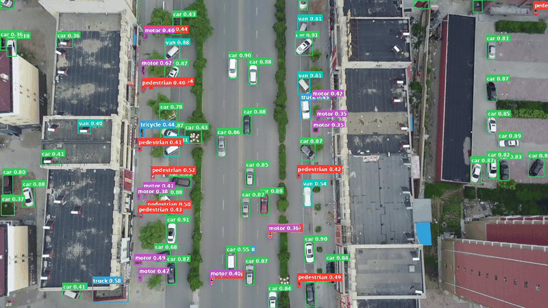

# D-FINE VisDrone: Aerial Object Detection on the Edge

Fine-tuning [D-FINE](https://arxiv.org/abs/2410.13842) (ICLR 2025) on the VisDrone aerial dataset, with structured pruning and INT8 deployment to a Snapdragon mobile NPU. Includes a Flutter web app for live inference.

---

## Results

| Stage | AP50:95 | AP50 | Latency | Model Size |
|-------|---------|------|---------|------------|
| COCO pretrained (baseline) | 48.5% (COCO val) | 65.4% | — | 38 MB FP32 |
| VisDrone fine-tuned | 23.1% | 38.9% | — | 38 MB FP32 |
| + Structured pruning + recovery | **23.2%** | — | — | ~28 MB FP32 |
| INT8 on Snapdragon 8 Gen 2 | — | — | **47 ms / 21 FPS** | **10 MB INT8** |

SOTA context (VisDrone val, standard eval): UAV-DETR-R50 (2025) = 31.5%, RT-DETR-R50 (2023) = 28.4%. Gap vs SOTA is explained by model size (10M vs 50M+ params) and input resolution (640px vs 1280–1536px). 100% NPU utilization on Hexagon v73 (1316/1317 ops offloaded).

---

## Demo



*D-FINE-S (pruned, INT8-ready) running on VisDrone validation images — 10-class aerial detection at 21 FPS on Snapdragon 8 Gen 2.*

---

## Key Engineering Decisions

- **D-FINE-S over YOLO or larger DETR variants** — sacrifices ~8 AP points vs YOLOv8-X but is 7× smaller; for Snapdragon NPU deployment, parameter efficiency matters more than peak accuracy, and the FDR distribution head compensates for scale
- **CosineAnnealingLR over MultiStepLR** — milestone-based decay never fired in 72 epochs on this dataset; switching to cosine alone lifted AP from 0.170 → 0.231 (+36%), no architecture change
- **Decoder FFNs as pruning target** — decoder FFN layers dominated inference cost; used group lasso regularization to let the model self-select neuron importance rather than applying a fixed compression ratio, achieving 41.4% reduction with no AP regression
- **640px as final input resolution** — ran 4 attempts at 960–1280px; all failed due to anchor grid mismatch when transferring a 640px checkpoint to 2.3× more spatial positions; concluded that 6.5k training images is insufficient to re-learn the proposal grid at higher resolution
- **ONNX + Qualcomm AI Hub over on-device PyTorch** — AI Hub handles Hexagon NPU mapping and INT8 quantization automatically; offloads hardware-specific compiler complexity and gives profiling data (latency, memory, NPU utilization) without owning a device

---

## Limitations

- AP trails published VisDrone-specific SOTA (23.1% vs 31.5%) — gap is primarily input resolution; attempts to train at 1280px failed due to anchor grid mismatch with the dataset size
- Tiny crowded objects (46–53% of VisDrone instances are < 32px) remain the hardest case; AP-small is 0.142
- SAHI sliced inference improved AP-small (+0.011) but hurt overall AP (-0.006) due to patch-boundary fragmentation of larger objects — no clean win
- Accuracy comparison against YOLOv8-X favors YOLO (AP50 0.470 vs 0.389) — expected given 68M vs 10M parameters; D-FINE-S is the better deployment target, not the better accuracy target

---

## Why VisDrone is Hard

| Property | VisDrone | COCO |
|----------|----------|------|
| Viewpoint | Aerial / top-down | Ground level |
| Objects/image | 53–70 | ~7 |
| Tiny objects (< 32px) | 46–53% | ~15% |
| Classes | 10 (vehicles + pedestrians) | 80 |

Classes: `pedestrian, people, bicycle, car, van, truck, tricycle, awning-tricycle, bus, motor`

---

## What This Repo Contains

```
DFine/
├── D-FINE/                        <- main training codebase (D-FINE + VisDrone configs)
│   ├── configs/dfine/             <- YAML configs for COCO, VisDrone, pruning experiments
│   ├── src/zoo/dfine/             <- D-FINE decoder, encoder, FDR + GO-LSD losses
│   ├── src/nn/backbone/           <- HGNetV2 backbone
│   ├── tools/
│   │   ├── inference/             <- torch_inf.py, onnx_inf.py, sahi_inf.py
│   │   ├── deployment/            <- export_onnx_pruned.py, submit_aihub.py
│   │   └── pruning/               <- prune_dfine.py, recovery_train.py
│   ├── train.py                   <- single entry point for training + eval
│   └── PROJECT_NOTES/             <- lab notebook (all decisions, results, bugs)
├── dfine_app_server/              <- FastAPI inference server (D-FINE + YOLOv8)
│   ├── server_v1.py               <- active server: both models, letterbox preprocessing
│   ├── sota_compare.py            <- side-by-side comparison script
│   └── models/best.pt             <- YOLOv8-X VisDrone weights
└── dfine_app/                     <- Flutter web app
    └── lib/main.dart              <- model selector, camera/gallery picker, box overlay
```

---

## Architecture

**3-stage pipeline:** HGNetV2 backbone → HybridEncoder (neck) → DFINETransformer (decoder)

### D-FINE Innovations

**FDR (Fine-grained Distribution Refinement):** Instead of predicting a single (Δx,Δy,Δw,Δh) offset per box edge, the model predicts a probability distribution over `reg_max=32` non-uniformly spaced bins. The final edge position is the weighted expectation over those bins. This lets the model express localization uncertainty and produces tighter boxes than single-point regression.

**GO-LSD (Global Optimal Localization Self-Distillation):** The final decoder layer's predicted distributions are used as soft targets for earlier layers during training. Zero inference overhead — only active during the forward pass at training time.

---

## Setup

**Requirements:** Python 3.12, PyTorch 2.5.1+cu124, NVIDIA GPU (tested on RTX 4060 Laptop 8GB)

```bash
cd D-FINE
python -m venv venv
source venv/Scripts/activate       # Windows / WSL2
# or: source venv/bin/activate     # Linux
pip install -r requirements.txt
pip install wandb                  # optional, for W&B logging
```

---

## Training

```bash
# Fine-tune from COCO pretrained weights on VisDrone
python train.py -c configs/dfine/dfine_hgnetv2_s_visdrone.yml \
    --device cuda:0 --tuning weight/dfine_s_coco.pth

# Override batch size for single-GPU (default config assumes 4×GPU)
python train.py -c configs/dfine/dfine_hgnetv2_s_visdrone.yml \
    --device cuda:0 --tuning weight/dfine_s_coco.pth \
    -u train_dataloader.total_batch_size=4

# Eval only
python train.py -c configs/dfine/dfine_hgnetv2_s_visdrone.yml \
    --device cuda:0 --test-only --resume output/dfine_hgnetv2_s_visdrone/best_stg1.pth
```

**Key flags:**
- `-t / --tuning` — load weights, reset optimizer (use for domain transfer)
- `-r / --resume` — load weights + optimizer state (use to resume an interrupted run)

---

## Structured Pruning

Removes FFN neurons from the 3 transformer decoder layers using group lasso regularization, then runs a 10-epoch recovery phase. Achieves 41.4% FFN reduction with no AP regression.

```bash
# Run pruning loop (saves checkpoint at each epoch, stops when AP drops below floor)
python tools/pruning/prune_dfine.py \
    -c configs/dfine/dfine_hgnetv2_s_visdrone.yml \
    --checkpoint output/dfine_hgnetv2_s_visdrone/best_stg1.pth \
    --output-dir output/pruning --device cuda:0

# Recovery training after pruning
python tools/pruning/recovery_train.py \
    -c configs/dfine/dfine_hgnetv2_s_visdrone.yml \
    --pruned-checkpoint output/pruning/best_pruned.pth \
    --output-dir output/pruning_recovery --device cuda:0
```

Best checkpoint: `output/pruning_recovery/best_recovery.pth`
FFN dims after pruning: `[598, 780, 423]` (from `[1024, 1024, 1024]`)

---

## ONNX Export + Deployment

```bash
# Export pruned model to ONNX (handles non-standard FFN dims automatically)
python tools/deployment/export_onnx_pruned.py \
    --config configs/dfine/dfine_hgnetv2_s_visdrone.yml \
    --checkpoint output/pruning_recovery/best_recovery.pth \
    --output output/pruning_recovery/best_recovery.onnx

# Submit to Qualcomm AI Hub for INT8 compilation + profiling
python tools/deployment/submit_aihub.py \
    --onnx output/pruning_recovery/best_recovery.onnx
```

---

## Inference

```bash
# PyTorch inference (single image)
python tools/inference/torch_inf.py \
    -c configs/dfine/dfine_hgnetv2_s_visdrone.yml \
    -r output/pruning_recovery/best_recovery.pth \
    --input image.jpg --device cuda:0

# ONNX inference
python tools/inference/onnx_inf.py \
    --onnx output/pruning_recovery/best_recovery.onnx \
    --input image.jpg

# SAHI (sliced) inference — improves AP-small slightly, use with care
python tools/inference/sahi_inf.py \
    -c configs/dfine/dfine_hgnetv2_s_visdrone.yml \
    -r output/pruning_recovery/best_recovery.pth \
    --input image.jpg
```

---

## Flutter App + Inference Server

A web app that runs D-FINE-S and YOLOv8-X side-by-side on any image.

**Start the server:**
```bash
cd dfine_app_server
pip install fastapi uvicorn onnxruntime ultralytics pillow
uvicorn server_v1:app --host 0.0.0.0 --port 8000
```

**Start the Flutter app:**
```bash
cd dfine_app
flutter run -d chrome --release
# or: flutter build web && serve build/web on port 8080
```

The server loads both models at startup. `POST /detect` accepts `file` + `model` (dfine|yolov8) as multipart form fields. The Flutter app has a model selector dropdown, gallery/camera picker, and a bounding box overlay with per-class colours.

**Model comparison:**

| Model | Params | AP50:95 | AP50 |
|-------|--------|---------|------|
| D-FINE-S (ours, pruned) | 10M | 0.232 | 0.389 |
| YOLOv8-X (mshamrai HuggingFace) | 68M | — | 0.470 |

---

## Lab Notebook

All decisions, experiments, results, and bugs are documented in `D-FINE/PROJECT_NOTES/`:

| File | Contents |
|------|----------|
| `00_progress.md` | Step-by-step log, current status |
| `01_repo_structure.md` | Architecture deep-dive, config system |
| `02_coco_baseline.md` | COCO baseline: 48.5 mAP reproduced |
| `03_visdrone_dataset.md` | Dataset stats, class distribution, challenges |
| `04_finetuning_config.md` | Fine-tuning configuration decisions |
| `05_wsl2_aws_kubernetes.md` | WSL2 migration + AWS/K8s plan |
| `06_aws_kubernetes_setup.md` | AWS setup log |
| `06_bugs_and_fixes.md` | All bugs encountered and fixed |
| `07_pruning.md` | Full pruning results table, epoch-by-epoch |

---

## Reference

- [D-FINE paper](https://arxiv.org/abs/2410.13842) (ICLR 2025)
- [Original D-FINE repo](https://github.com/Peterande/D-FINE)
- [VisDrone dataset](https://github.com/VisDrone/VisDrone-Dataset)
- [Qualcomm AI Hub](https://aihub.qualcomm.com/)
- W&B training runs: [wandb.ai/danziv/D-FINE](https://wandb.ai/danziv/D-FINE)
