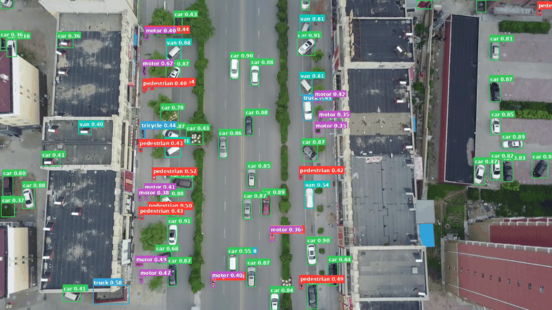

# D-FINE VisDrone: Aerial Object Detection on the Edge

Fine-tuning [D-FINE](https://arxiv.org/abs/2410.13842) (ICLR 2025) on the VisDrone aerial dataset, with structured pruning and INT8 deployment to a Snapdragon mobile NPU. Includes a Flutter web app for live inference.

---

## Results

| Stage | AP50:95 | AP50 | AP-small | Latency | Model Size |
|-------|---------|------|----------|---------|------------|
| COCO pretrained (baseline) | 48.5% (COCO val) | 65.4% | - | - | 38 MB FP32 |
| VisDrone fine-tuned (640px) | 23.1% | 38.9% | 14.2% | - | 38 MB FP32 |
| + Structured pruning + recovery | 23.2% | - | - | - | ~28 MB FP32 |
| Multi-scale training 1024px (80 ep) | 25.5% | 42.4% | 17.8% | - | 38 MB FP32 |
| + Extended training (131 ep) | 29.7% | 47.9% | 20.8% | - | 38 MB FP32 |
| + Mosaic + multi-scale retraining (160 ep) | 31.6% | 50.7% | 22.5% | - | 38 MB FP32 |
| + NWD matching + size-adaptive loss (ep109) | **32.1%** | **50.4%** | **23.0%** | - | 38 MB FP32 |
| INT8 on Snapdragon 8 Gen 2 | - | - | - | **47 ms / 21 FPS** | **10 MB INT8** |

SOTA context (VisDrone val, standard eval): DroneScan-YOLO (2026) = 35.6% (10M params, purpose-built for aerial), Drone-DETR (2024) = 33.9%, VRF-DETR (2024) = 32.2%, RT-DETR-R50 (2023) = 28.4%. D-FINE-S reaches **32.1%** with 10M params as a general-purpose detector fine-tuned on VisDrone - gap to same-size SOTA is ~3.5 AP points, primarily due to domain-specific architecture choices (custom small-object heads, aerial-specific FPN). 100% NPU utilization on Hexagon v73 (1316/1317 ops offloaded).

### Per-class AP - epoch-131 checkpoint (baseline for Mosaic+RFS retraining)

| Class | Train freq | AP50:95 | AP50 | AP-small | AP-med | AP-large |
|-------|-----------|---------|------|----------|--------|---------|
| car | 42% | **0.619** | **0.858** | 0.453 | 0.750 | **0.873** |
| bus | 5% | 0.458 | 0.607 | 0.232 | 0.575 | 0.856 |
| van | 8% | 0.373 | 0.516 | 0.203 | 0.519 | 0.586 |
| pedestrian | 22% | 0.286 | 0.562 | 0.247 | 0.523 | **0.843** |
| motor | 11% | 0.294 | 0.591 | 0.265 | 0.416 | 0.561 |
| truck | 4% | 0.284 | 0.395 | 0.124 | 0.322 | 0.604 |
| people | 14% | 0.213 | 0.486 | 0.201 | 0.327 | 0.648 |
| tricycle | 3% | 0.201 | 0.334 | 0.161 | 0.262 | 0.491 |
| bicycle | 4% | 0.129 | 0.253 | 0.097 | 0.275 | 0.316 |
| awning-tricycle | 1% | **0.110** | **0.185** | **0.094** | **0.144** | **0.113** |
| **mean** | | **0.297** | **0.479** | **0.208** | **0.411** | **0.589** |

The two rarest classes (awning-tricycle 1%, tricycle 3%) are the weakest. RFS oversampling and Mosaic augmentation in the current retraining run specifically target this gap.

---

## Inference-Time Ablation (no retraining)

All experiments run on the epoch-131 checkpoint (AP=29.7%, 1024px eval). Multi-scale training already internalizes the benefits that inference-time tricks try to add - none improved on standard eval. Full analysis in `PROJECT_NOTES/11_eval_ablations.md`.

| Method | AP50:95 | AP-small | Delta | Verdict |
|--------|---------|----------|-------|---------|
| Standard eval (1024×1024) | **29.7%** | **20.8%** | - | Best |
| Eval at 1280×1280 | 29.6% | 21.2% | −0.1% | No gain |
| SAHI 1024px slices | 28.0% | 19.9% | −1.7% | Hurts |
| SAHI 640px slices (→1024px) | 28.3% | 20.8% | −1.4% | Hurts |
| TTA 1024px + hflip (WBF) | 27.6% | 18.4% | −2.1% | Hurts |
| TTA 3-scale + hflip (WBF) | 28.0% | 19.1% | −1.7% | Hurts |
| SWA ep107+119+131 | 29.5% | - | −0.2% | Negligible |
| SWA ep119+131 | 29.6% | 20.7% | ±0 | Neutral |

**Why everything fails:** Each trick assumes the model hasn't learned something - scale invariance (SAHI, TTA), flip invariance (TTA hflip), or basin convergence (SWA). After 130+ epochs of [768–1280] multi-scale training with `RandomHorizontalFlip` and copy-paste augmentation, all of these are already internalized. The only lever left is retraining with new signal: new augmentation diversity (mosaic, now in progress) or architectural changes (P2 detection head, NWD loss).

---

## Demo



*D-FINE-S (pruned, INT8-ready) running on VisDrone validation images - 10-class aerial detection at 21 FPS on Snapdragon 8 Gen 2.*

---

## Key Engineering Decisions

- **D-FINE-S over YOLO or larger DETR variants** - sacrifices ~8 AP points vs YOLOv8-X but is 7× smaller; for Snapdragon NPU deployment, parameter efficiency matters more than peak accuracy, and the FDR distribution head compensates for scale
- **CosineAnnealingLR over MultiStepLR** - milestone-based decay never fired in 72 epochs on this dataset; switching to cosine alone lifted AP from 0.170 → 0.231 (+36%), no architecture change
- **Decoder FFNs as pruning target** - decoder FFN layers dominated inference cost; used group lasso regularization to let the model self-select neuron importance rather than applying a fixed compression ratio, achieving 41.4% reduction with no AP regression
- **Multi-scale training from COCO (not from 640px checkpoint)** - 4 direct attempts to train at 960–1280px all failed (AP flatlined at 0.11–0.13); root cause was anchor grid collapse when jumping from 8,400 → 19,320 positions. The fix: start from the COCO checkpoint with multi-scale [768–1280] from epoch 0, so the model never locks into a single-scale prior. This lifted AP from 0.231 → 0.297 (+28%).
- **Adaptive batch size over fixed batch** - training at 1280px with fixed batch=2 would waste capacity at 768px and OOM at 1280px; adaptive batch keeps total pixel budget constant (`n ∝ (base_size/sz)²`), giving effective batch=8 across all scales
- **ONNX + Qualcomm AI Hub over on-device PyTorch** - AI Hub handles Hexagon NPU mapping and INT8 quantization automatically; offloads hardware-specific compiler complexity and gives profiling data (latency, memory, NPU utilization) without owning a device

---

## Limitations

- AP trails published VisDrone-specific SOTA (32.1% vs 35.6% DroneScan-YOLO) - gap is primarily architectural: purpose-built models add a P2 stride-4 detection head and NWD loss tuned for sub-16px objects; D-FINE-S uses a general-purpose FPN without aerial-specific modifications
- Tiny crowded objects (46–53% of VisDrone instances are < 32px) remain the hardest case; AP-small is 21.1% (up from 14.2% at 640px, but still low - awning-tricycle and bicycle AP are well below the mean)
- All inference-time tricks tested (SAHI, TTA, SWA, higher eval resolution) failed to improve over standard eval - the model's multi-scale training already internalizes what these try to add
- Current best (32.1%, ep109) is NWD matching + sqrt size-adaptive loss; next experiments target MSFD-style P2 fusion and linear 1/area SAL to close the remaining ~3.5 AP gap to DroneScan-YOLO

---

## Why VisDrone is Hard

| Property | VisDrone | COCO |
|----------|----------|------|
| Viewpoint | Aerial / top-down | Ground level |
| Objects/image | 53–70 | ~7 |
| Tiny objects (< 32px) | 46–53% | ~15% |
| Classes | 10 (vehicles + pedestrians) | 80 |

Classes: `pedestrian, people, bicycle, car, van, truck, tricycle, awning-tricycle, bus, motor`

---

## What This Repo Contains

```
DFine/
├── D-FINE/                        <- main training codebase (D-FINE + VisDrone configs)
│   ├── configs/dfine/             <- YAML configs for COCO, VisDrone, pruning experiments
│   ├── src/zoo/dfine/             <- D-FINE decoder, encoder, FDR + GO-LSD losses
│   ├── src/nn/backbone/           <- HGNetV2 backbone
│   ├── tools/
│   │   ├── inference/             <- torch_inf.py, onnx_inf.py, sahi_inf.py
│   │   ├── deployment/            <- export_onnx_pruned.py, submit_aihub.py
│   │   └── pruning/               <- prune_dfine.py, recovery_train.py
│   ├── train.py                   <- single entry point for training + eval
│   └── PROJECT_NOTES/             <- lab notebook (all decisions, results, bugs)
├── dfine_app_server/              <- FastAPI inference server (D-FINE + YOLOv8)
│   ├── server_v1.py               <- active server: both models, letterbox preprocessing
│   ├── sota_compare.py            <- side-by-side comparison script
│   └── models/best.pt             <- YOLOv8-X VisDrone weights
└── dfine_app/                     <- Flutter web app
    └── lib/main.dart              <- model selector, camera/gallery picker, box overlay
```

---

## Architecture

**3-stage pipeline:** HGNetV2 backbone → HybridEncoder (neck) → DFINETransformer (decoder)

### D-FINE Innovations

**FDR (Fine-grained Distribution Refinement):** Instead of predicting a single (Δx,Δy,Δw,Δh) offset per box edge, the model predicts a probability distribution over `reg_max=32` non-uniformly spaced bins. The final edge position is the weighted expectation over those bins. This lets the model express localization uncertainty and produces tighter boxes than single-point regression.

**GO-LSD (Global Optimal Localization Self-Distillation):** The final decoder layer's predicted distributions are used as soft targets for earlier layers during training. Zero inference overhead - only active during the forward pass at training time.

---

## Setup

**Requirements:** Python 3.12, PyTorch 2.5.1+cu124, NVIDIA GPU (tested on RTX 4060 Laptop 8GB)

```bash
cd D-FINE
python -m venv venv
source venv/Scripts/activate       # Windows / WSL2
# or: source venv/bin/activate     # Linux
pip install -r requirements.txt
pip install wandb                  # optional, for W&B logging
```

---

## Training

```bash
# Fine-tune from COCO pretrained weights on VisDrone
python train.py -c configs/dfine/dfine_hgnetv2_s_visdrone.yml \
    --device cuda:0 --tuning weight/dfine_s_coco.pth

# Override batch size for single-GPU (default config assumes 4×GPU)
python train.py -c configs/dfine/dfine_hgnetv2_s_visdrone.yml \
    --device cuda:0 --tuning weight/dfine_s_coco.pth \
    -u train_dataloader.total_batch_size=4

# Eval only
python train.py -c configs/dfine/dfine_hgnetv2_s_visdrone.yml \
    --device cuda:0 --test-only --resume output/dfine_hgnetv2_s_visdrone/best_stg1.pth
```

**Key flags:**
- `-t / --tuning` - load weights, reset optimizer (use for domain transfer)
- `-r / --resume` - load weights + optimizer state (use to resume an interrupted run)

---

## Structured Pruning

Removes FFN neurons from the 3 transformer decoder layers using group lasso regularization, then runs a 10-epoch recovery phase. Achieves 41.4% FFN reduction with no AP regression.

```bash
# Run pruning loop (saves checkpoint at each epoch, stops when AP drops below floor)
python tools/pruning/prune_dfine.py \
    -c configs/dfine/dfine_hgnetv2_s_visdrone.yml \
    --checkpoint output/dfine_hgnetv2_s_visdrone/best_stg1.pth \
    --output-dir output/pruning --device cuda:0

# Recovery training after pruning
python tools/pruning/recovery_train.py \
    -c configs/dfine/dfine_hgnetv2_s_visdrone.yml \
    --pruned-checkpoint output/pruning/best_pruned.pth \
    --output-dir output/pruning_recovery --device cuda:0
```

Best checkpoint: `output/pruning_recovery/best_recovery.pth`
FFN dims after pruning: `[598, 780, 423]` (from `[1024, 1024, 1024]`)

---

## ONNX Export + Deployment

```bash
# Export pruned model to ONNX (handles non-standard FFN dims automatically)
python tools/deployment/export_onnx_pruned.py \
    --config configs/dfine/dfine_hgnetv2_s_visdrone.yml \
    --checkpoint output/pruning_recovery/best_recovery.pth \
    --output output/pruning_recovery/best_recovery.onnx

# Submit to Qualcomm AI Hub for INT8 compilation + profiling
python tools/deployment/submit_aihub.py \
    --onnx output/pruning_recovery/best_recovery.onnx
```

---

## Inference

```bash
# PyTorch inference (single image)
python tools/inference/torch_inf.py \
    -c configs/dfine/dfine_hgnetv2_s_visdrone.yml \
    -r output/pruning_recovery/best_recovery.pth \
    --input image.jpg --device cuda:0

# ONNX inference
python tools/inference/onnx_inf.py \
    --onnx output/pruning_recovery/best_recovery.onnx \
    --input image.jpg

# SAHI (sliced) inference - tested, does NOT improve AP on this model (see ablation table)
python tools/inference/sahi_inf.py \
    -c configs/dfine/dfine_hgnetv2_s_visdrone_ms1280_cont.yml \
    -r output/dfine_hgnetv2_s_visdrone_ms1280_cont/best_stg1.pth \
    --input image.jpg --slice-size 1024

# TTA (multi-scale + flip) - also tested, hurts due to WBF noise; shown for completeness
python tools/inference/tta_inf.py \
    -c configs/dfine/dfine_hgnetv2_s_visdrone_ms1280_cont.yml \
    -r output/dfine_hgnetv2_s_visdrone_ms1280_cont/best_stg1.pth \
    --ann dataset/visdrone/annotations/instances_val.json \
    --img-dir dataset/visdrone/VisDrone2019-DET-val/images
```

---

## Flutter App + Inference Server

A web app that runs D-FINE-S and YOLOv8-X side-by-side on any image.

**Start the server:**
```bash
cd dfine_app_server
pip install fastapi uvicorn onnxruntime ultralytics pillow
uvicorn server_v1:app --host 0.0.0.0 --port 8000
```

**Start the Flutter app:**
```bash
cd dfine_app
flutter run -d chrome --release
# or: flutter build web && serve build/web on port 8080
```

The server loads both models at startup. `POST /detect` accepts `file` + `model` (dfine|yolov8) as multipart form fields. The Flutter app has a model selector dropdown, gallery/camera picker, and a bounding box overlay with per-class colours.

**Model comparison:**

| Model | Params | AP50:95 | AP50 |
|-------|--------|---------|------|
| D-FINE-S (ours, current best) | 10M | 0.321 | 0.504 |
| D-FINE-S (ours, pruned INT8) | 10M | 0.232 | 0.389 |
| YOLOv8-X (mshamrai HuggingFace) | 68M | - | 0.470 |

---

## Lab Notebook

All decisions, experiments, results, and bugs are documented in `D-FINE/PROJECT_NOTES/`:

| File | Contents |
|------|----------|
| `00_progress.md` | Step-by-step log, current status |
| `01_repo_structure.md` | Architecture deep-dive, config system |
| `02_coco_baseline.md` | COCO baseline: 48.5 mAP reproduced |
| `03_visdrone_dataset.md` | Dataset stats, class distribution, challenges |
| `04_finetuning_config.md` | Fine-tuning configuration decisions |
| `05_wsl2_aws_kubernetes.md` | WSL2 migration + AWS/K8s plan |
| `06_aws_kubernetes_setup.md` | AWS setup log |
| `06_bugs_and_fixes.md` | All bugs encountered and fixed (BUG-001 → BUG-017) |
| `07_pruning.md` | Full pruning results table, epoch-by-epoch |
| `09_multiscale_training.md` | Multi-scale training runs 1–3, full AP trajectories, why it worked |
| `10_sota_gap_analysis.md` | Gap to DroneScan-YOLO: what they do differently, what's transferable |
| `11_eval_ablations.md` | Deep dive: every inference-time trick tried, why each failed |

---

## Reference

- [D-FINE paper](https://arxiv.org/abs/2410.13842) (ICLR 2025)
- [Original D-FINE repo](https://github.com/Peterande/D-FINE)
- [VisDrone dataset](https://github.com/VisDrone/VisDrone-Dataset)
- [Qualcomm AI Hub](https://aihub.qualcomm.com/)
- W&B training runs: [wandb.ai/danziv/D-FINE](https://wandb.ai/danziv/D-FINE)
